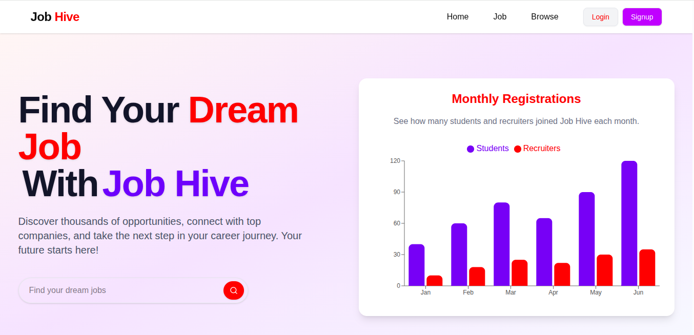
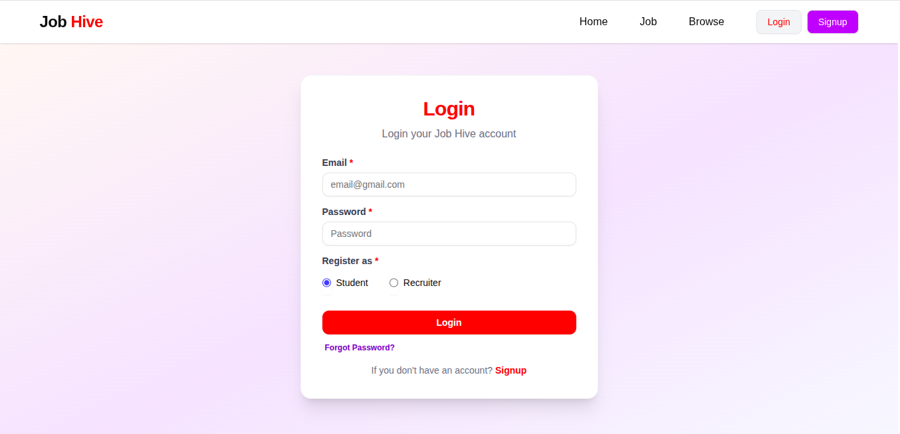
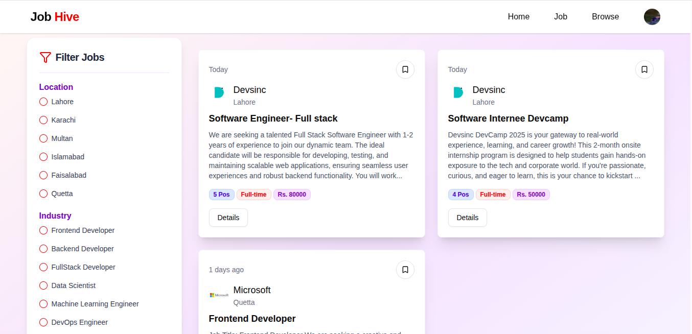
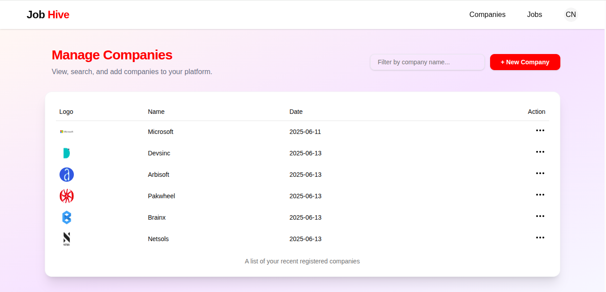

# JobHive

JobHive is a modern job portal web application that connects students and recruiters. It allows students to browse and apply for jobs, while recruiters can post jobs and manage applications. The platform features secure authentication, OTP-based password reset, and a user-friendly interface.

## Features

- Student and Recruiter roles
- Secure authentication (login/signup/logout)
- Password reset with OTP verification
- Profile management for students
- Job posting and management for recruiters
- Browse and search jobs
- Responsive UI with React and Tailwind CSS
- Email notifications for OTP and password reset

## Tech Stack

- **Frontend:** React, Tailwind CSS, Axios, React Router
- **Backend:** Node.js, Express.js
- **Database:** MongoDB (Mongoose)
- **Authentication:** JWT, Cookies
- **Email:** Nodemailer (Gmail SMTP/App Password)
- **Cloud Storage:** Cloudinary (for resumes and profile photos)

## Getting Started

### Prerequisites

- Node.js (v18+ recommended)
- MongoDB Atlas account
- Gmail account for sending OTP emails (App Password required)

## Screenshots

### Home Page

[](data/Home.png)

### Login Page



### Filter Page



### Dashboard



### Installation

1. **Clone the repository:**
   ```bash
   git clone https://github.com/yourusername/JobHive.git
   cd JobHive
   ```
2. **Frontend Setup:**
   ```bash
   cd client
   npm install
   npm run dev
   ```
3. **Backend Setup:**
   ```bash
   cd server
   npm install
   npm start
   ```
4. **Environment Variable**

**Create a `.env` file in the server directory with the following:**

```env
PORT = 8000
DB_URL = your_mongodb_connection_string
SECRET_KEY = your_secret_key
CLOUD_NAME = your_cloudinary_cloud_name
CLOUD_API_KEY = your_cloudinary_api_key
CLOUD_API_SECRET = your_cloudinary_api_secret
EMAIL_SERVICE = gmail
EMAIL_USER = your_gmail_address #sender email
EMAIL_PASSWORD = your_gmail_app_password # sender email app security password
```

**Email_Password is a 16-digit Google password which you can find in your Gmail security app passwords. So please don't confuse it.**

### Usage

- Visit http://localhost:3000 to access the frontend.
- Register as a student or recruiter.
- Students can browse and apply for jobs.
- Recruiters can post and manage jobs.
- Use "Forgot Password" to reset your password via `OTP 6 Digits`.

#### JobHive/

```
├── data/           # Screenshots
├── client/         # React frontend
├── server/         # Node.js/Express backend
├── License.md
├── (!)Readme.md
```

#### Contribution

Contributions are welcome! If you want to contribute to JobHive:

1. Fork the repository.
2. Create a new branch (`git checkout -b feature/your-feature`).
3. Commit your changes (`git commit -m 'Add some feature'`).
4. Push to the branch (`git push origin feature/your-feature`).
5. Open a Pull Request.

---

**License**

This project is licensed under the MIT License.
